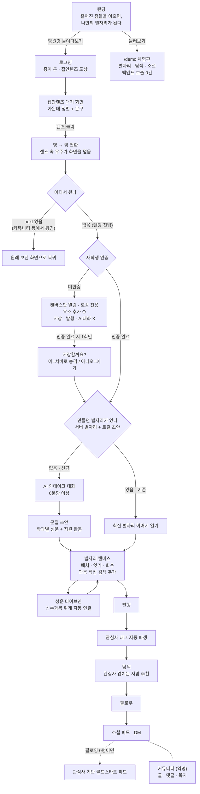

# OurLab — 기획/PM 포트폴리오

> 근거: 이 저장소의 코드·커밋(368건)·핸드오프 문서 실측. 확인 안 된 항목은 `[확인 필요]`, 측정 안 된 지표는 `[측정 안 됨]`으로 남김.

---

## 0. 서비스 한 줄 요약

**진로를 고민하는 학생**이 "뭘 해야 할지 모르겠는" 상태에서, 몇 가지 질문에 답하면 **수업·자격증·활동을 이어 붙인 로드맵을 별자리 형태로** 만들어주고, 같은 관심사를 가진 학생들과 익명으로 이어주는 서비스.

- **서비스명**: OurLab (구 CareerCompass → 2026-08-25 리브랜드)
- **상태**: **배포 완료** — Google Cloud Run(서울, `asia-northeast3`) 프론트/백엔드 2개 서비스 + Firestore 운영 프로젝트(`ourlab-0808`). 실제 Claude API 호출까지 라이브에서 동작
- **URL**: https://ourlab-frontend-902034641778.asia-northeast3.run.app
- **체험 계정** (비밀번호 전부 `observatory123!`)
  - **완성된 결과를 보려면 `test-observer@yonsei.ac.kr`** — 이미 만들어 둔 별자리와 노드가 채워진 캔버스로 바로 들어간다. *이미 쓰던 사람에게는 AI 대화를 다시 띄우지 않는다*는 설계 규칙이 적용된 상태
  - **차단을 보려면 `demo-unverified@example.com`** — 열람은 되고 클릭·작성은 막히는 3계층 접근 모델을 그대로 확인할 수 있다
  - 로그인 없이 둘러보려면 `/demo`
- 별도 확보 도메인: `ourcompass.co.kr` / 저장소 `feature/constellation` 브랜치
- **첫 시장(beachhead)**: 연세대. 재학생 인증 게이트와 대학요람 파싱이 연세대 기준으로 구현돼 있어 **1차 대상이 연세대 학생일 뿐**, 문제 정의 자체는 학교를 가리지 않는다. 다른 학교로 넓히려면 **인증 방식과 과목 데이터 소스만 교체**하면 되는 구조(`backend/app/etl/`가 학교별 파서 단위로 분리)
- 근거: `CLAUDE.md`, `docs/backend-session-handoff.md`, `frontend/package.json`(cf:deploy 스크립트)

## 1. 프로젝트 개요

- **개발 기간**: 2026-05-05(`c97fbb4`) ~ 2026-08-30(`91fbbdb`), 약 4개월
- **팀 구성**: **1인 개발**(git author 368/368건 동일). 기획·설계·구현·QA 전 과정 단독. 실제 코딩은 AI 에이전트에 위임하고 **요구 정의·설계 판단·검수를 담당하는 방식**으로 진행
- **기술 스택**: Next.js 14 + TypeScript / FastAPI + Pydantic v2 / Firestore(주력) + PostgreSQL(레거시) / Firebase Auth / **Anthropic Claude**(로드맵 생성·군집화·선수과목 추론) / Google Cloud Run 배포(서울 리전)
- **규모**: 화면 **19개**, API 엔드포인트 **약 121개**, 컴포넌트 43개, 테스트 함수 **162개**, 코드 **약 54,000줄**(Python 31.4k / TSX 19.6k / TS 3.4k), 커밋 **368건**
- 근거: `backend/pyproject.toml`, `frontend/package.json`, `git log`, `backend/app/api/`, `frontend/app/`

## 2. 문제 정의

- **진로를 고민하는 학생은 "선택지가 너무 많은데 기준이 없는" 상태**에 놓인다. 무슨 수업을 들어야 하는지, 그게 어디로 이어지는지, 지금의 선택이 나중에 무엇과 연결되는지를 이어서 보여주는 장치가 없다. 전공이 정해지지 않았거나 전공과 다른 진로를 고민하는 저학년일수록 이 공백이 크다.
- **문제가 실재한다고 판단한 근거**
  - 학교가 주는 정보는 **과목 단위로 끊겨 있다**. 수강편람·요람 어디에도 "이 수업 다음에 무엇"이라는 연결이 없다 — 실제로 대학요람 원문을 파싱해 보니 선수과목 관계가 **데이터로 존재하지 않아**, 이 서비스는 그 위계를 LLM으로 추론해 만들어야 했다(`backend/app/llm/anthropic_client.py`의 선수과목 대원칙)
  - 진로 정보와 학사 정보가 **서로 다른 곳에 흩어져** 있다. 수업은 학교, 자격증·대외활동은 각각 다른 서비스, 사람은 커뮤니티 — 하나의 경로로 묶이지 않는다
  - `[확인 필요]` 사용자 인터뷰·설문 등 **정량적 문제 검증 기록은 저장소에 없음**. 위 근거는 데이터 구조에서 확인된 것이고, 실사용자 대상 검증은 배포 이후 과제
- **기존 대안의 한계**
  - 학교 수강편람: 과목 목록일 뿐 "나에게 맞는 순서"를 알려주지 않음
  - 커리어 서비스(사람인·잡코리아 등): 취업 직전 단계용이고 학부 저학년의 탐색 단계를 다루지 않음. **이 프로젝트는 해당 사이트 스크래핑을 명시적으로 금지**(부정경쟁방지법·저작권법) — 공개 데이터와 사용자 동의 기반만 사용
  - 에브리타임류 커뮤니티: 정보는 있으나 **개인화된 경로**로 정리되지 않음
- 근거: `CLAUDE.md`(Hard Rules), `backend/app/etl/yonsei_courses.py`, `data/yonsei-academic-rules-2026.txt`

## 3. 목표와 성공 기준

- **목표**: 대화 몇 번으로 "지금의 나에게 맞는 로드맵 초안"을 만들고, 그 로드맵이 **혼자 보는 계획서가 아니라 같은 길을 걷는 사람과 이어지는 매개**가 되게 하는 것. 진로 고민을 **혼자 검색하는 일**에서 **경로를 그리고 사람과 잇는 일**로 바꾸는 것이 핵심
- **성공 지표**: `[측정 안 됨]` — 애널리틱스 코드가 **전혀 없음**(analytics/mixpanel/amplitude/gtag/posthog 전체 grep 0건). 운영 로깅만 존재하며 사용자 행동 지표 수집 체계는 미구축
- 배포는 됐으나 **홍보 전**이라 실사용자 데이터는 아직 없다. 운영 Firestore에는 데모 계정 8개와 파싱한 수업 7,109과목이 적재돼 있다
- 근거: 전체 grep 결과, `data/emulator-backup/`, 운영 프로젝트 `ourlab-0808`

## 3-1. 설계 원칙 — 이 서비스가 지킨 것들

기능 목록보다 **판단 기준**이 이 프로젝트의 실체다. 아래 11가지가 4개월간 모든 결정을 관통했고, 전부 실제 개발 중 내린 판단에서 나왔다. 인용은 설계 당시 남긴 지시 원문이다.

---

## A. 제품이 무엇인가

### ⓪ 별자리는 별이 아니라, 잇고 이름 붙이는 행위다
이 서비스의 근본 명제. 같은 밤하늘을 두고 문화마다 다른 그림을 그렸듯, **과목 7,109개는 객관적으로 존재하지만 로드맵은 학생이 그린 그림**이다. 여기서 역할 분담이 나온다 — **데이터는 "무엇이 있나", AI는 "뭘 고를까", 사용자는 "어떻게 잇나".** 제품의 모든 화면이 이 구조를 따른다.

구현: AI가 군집 초안을 주고(`bin_suggestion`), 사용자가 캔버스에서 직접 잇고 이름 붙이고 회수한다 — `ConstellationCanvas.tsx`

### ① 폐쇄성이 곧 정체성이다
가입 문턱을 낮추자는 제안(학교 메일만 받으면 학생증 심사도, 이미지 저장 비용도 불필요)을 **거절했다.** 진로 고민을 털어놓는 공간에서 "여기 있는 사람은 다 같은 학교 학생"이라는 보장이 편의보다 중요하다고 봤다.
> "학교 메일 + 학생증 인증 둘 다 할 거야. 이 서비스의 핵심은 (학생만 쓸 수 있다는) 폐쇄성이야."

구현: 이메일 인증 + 학생증 심사 2단, 서버가 쓰기 엔드포인트 전체를 `require_yonsei_verified`로 방어

### ② 익명과 실명은 섞지 않는다
같은 캠퍼스라 아는 사람일 확률이 높다는 게 전제다. 그래서 **커뮤니티는 완전 익명, 소셜은 실명**으로 공간을 분리하고, 메시지 시스템도 둘로 나눴다(쪽지 vs DM). 아이콘조차 탭에 따라 배타적으로 바뀐다.
> "커뮤니티는 무조건 익명이니까 커뮤니티 탭 안에서만 따로 작동하는 쪽지 시스템을 만들어야 해."

구현: `community_notes`(익명·대상 단위 분리·라벨만) / `dm_threads`(실명·팔로우 기반) — `a2361d6`, `9a3a92b`

---

## B. 사용자 앞에서 지킨 것

### 3. 빈 화면을 만들지 않는다
신규 사용자에게 "아무것도 없는 화면"을 보여주는 순간 서비스는 죽는다. 이 원칙 하나 때문에 **이미 구현한 잠금 모델을 뒤집었고**(8-2), 피드·추천·캔버스 전부에 "비어 있을 때 무엇을 채울지"를 따로 설계했다.
> "처음에는 누구나 팔로워가 없으니까 아무것도 안 뜰 거 아니야. 그거 방지하려고."
> "있을 때 없을 때로 나눠놓지 말고 해당 부분을 추천 리스트 띄우는 곳으로 지정해놓고 계속 채워놔."

구현: 피드 3단 폴백(`following → interest → latest`), 추천 사이드바 2단 폴백, 추천 슬롯 상시 렌더 — `d3c93d8`, `e5a5981`, `e90ce1c`

### 4. 자동화가 사용자의 흐름을 가로채지 않는다
AI는 **도와주는 것**이지 **막아서는 것**이 아니다. 로드맵 생성 대화는 "정말 처음인 사용자의 첫 진입" 단 하나의 조건에서만 뜨고, 커뮤니티에 가려는 사람 앞을 막지 않는다.
> "이미 서비스를 사용 중이고 LLM 대화 필요 없이 커뮤니티나 다른 탭 들어가려는데 자꾸 LLM 뜨면 짜증 나겠어 안 나겠어."

같은 이유로 모션도 절제했다 — "너무 과하면 안 돼. 유저가 요소 편집하는 데에 거슬리면 안 되니까." 배경 애니메이션은 움직임이 잦아들면 루프 자체를 끊어 유휴 비용을 0으로 만든 뒤에야 허용했다.

구현: 진입 분기(신규=대화 / 기존=만들던 별자리 이어서), 로그인 후 목적지는 `next` 우선 — `fc8b862`, `SpaceBackdrop.tsx`

### 5. 되돌릴 수 있어야 한다
사용자가 한 모든 행동에는 취소 경로가 있어야 한다. 캔버스에 놓은 요소도, 익명 쪽지 차단도 마찬가지다.
> "캔버스에 끌어다 놓고 다시 군집에 요소를 끌어다 놓거나 (…) 요소 회수되게 하자."
> "차단 해제 넣어줘."

구현: 요소 회수(드래그 / 회색 바 클릭 두 경로), 쪽지 차단 해제 — `8598e8d`, `15e4874`

### 6. 보조 화면도 실물 품질로 만든다
데모·연습장·가이드를 "어차피 곁다리"라고 목업으로 때우지 않았다. 둘러보기 모드는 **백엔드 호출 0건**이면서도 실제 캔버스와 같은 컴포넌트를 쓴다.
> "UI 대충 만들지 말고 메인페이지 캔버스랑 똑같이 띄워."
> "퀄리티는 똑같아야 하지만 실제로 백엔드 연결하거나 그럴 필요 없이."

구현: `/demo` 3탭(합격 조건 = 서버 요청 0건, 실측 확인), 튜토리얼 내 실제 캔버스 연습장 — `a27c905`

### 7. AI는 시작점, 주도권은 사용자
AI가 초안을 주되 **사용자가 직접 고치고 더할 수 있어야** 자기 로드맵이 된다. 위계도 잠금이 아니라 표시로 뒀다.
> "결국 군집, 요소를 스스로 추가하는 경우도 많을 거란 말이야. 이때 학정번호와 수업 이름 검색 필터로 스스로 검색해서 수업을 띄웠으면 좋겠어."
> "학년과 수강 학년은 꼭 일치하지 않아도 돼. 그건 그냥 표시일 뿐이야. 물론 1학년이 곧바로 4학년 과목을 듣도록 추천하지는 않아야겠지만."

구현: 과목 검색 API + 필터 UI, 미인증도 캔버스는 열리고 로컬 저장, AI는 가드레일만 — `4db6fca`, `95e4612`

---

## C. 만들면서 지킨 것

### 8. 더하는 것보다 빼는 판단이 어렵다
알림을 하나 더 넣으면 알림함 전체가 안 쓰이게 된다. 서비스가 놓인 맥락(좁고 닫힌 네트워크)에서 **전체 공개 SNS는 작동하지 않는다**고 보고 축 하나를 통째로 걷어냈다.
> "알림함에 새 로드맵 발행 알림은 넣지 마. 넣으면 사람들 안 쓴다."
> "이건 폐쇄된 인적 네트워크 상에서 작동하는 서비스라 SNS를 빼는 게 나을 것 같아."

구현: 발행 알림 의도적 제외, 전체 공개 피드 폐지 → 소셜 탭을 팔로우 네트워크 전용으로, 죽은 API 삭제 — `f963dbf`

### 9. 하드코딩이 아니라 원칙을 세운다
"경영학과는 이렇게, 공학은 저렇게"로 분기하는 순간 확장이 멈춘다. 학과별 예외 대신 **일반 규칙을 세우고 그때그때 적용**하게 했다.
> "과목마다 미리 이어놓는다기보다는 대원칙을 세워놓고 API가 그때그때 적용할 수 있게."
> "물론 핵심적인 건 이어놔도 좋지만, 일반화된 규칙이 필요하단 말이야."

구현: 선수과목 위계를 학과 하드코딩 없이 **대원칙 프롬프트**로(학정번호 레벨·전공기초→필수→선택·개론→심화 명칭), 군집 병합도 학과명이 아니라 `id.startsWith("course:")` **구조 판정** — `92d36d7`, `d1a8d84`. 프로젝트 헌장에 "분야·학과 하드코딩 금지"로 명문화

### 10. 매몰비용 없이 되돌린다
완성한 것도 근거가 무너지면 버렸다. 이 프로젝트에서 **되돌린 결정이 최소 6건**이고, 그중 넷은 이미 동작하던 것을 버린 경우다.
> "그냥 다시 롤백하자." — DB 리전을 옮기면 빨라질 줄 알았는데 오히려 느려지자 즉시 원복
> "클라우드플레어도 테스트해 본 셈 치고 다음부터는 이걸로 안 쓸 거야." — 컨테이너 배포를 완성해 놓고 전면 폐기
> "데모에 5달러 태울 이유가 없는 것 같아." — 기능 결함이 아니라 비용만으로 유료 인프라 폐기
> "원래 있던 거에 디자인 올리지 말고 싹 갈아엎으라니까?" — 리브랜딩을 덧칠이 아니라 철거로

되돌린 목록: 콩나무 제품 전체(`36b768f`) / 외부 디자인 시안(롤백 후 아이디어 하나만 차용) / 팔로워 잠금(`44816d4`) / 비로그인 열람(하루 만에 회수, `e60cc18`) / Cloudflare 컨테이너 배포 / DB 리전 이관

### 11. 완벽한 데이터를 기다리지 않되, 없는 것을 지어내지도 않는다
두 태도가 한 쌍이다. **데이터 부재가 기능 부재가 되게 두지 않지만**, 없는 것을 그럴듯하게 추정해 채우지도 않는다.

*기다리지 않은 쪽* — 대학요람에 선수과목 관계가 **아예 없어서** 확보를 포기하고, 7,109과목 100%에 존재하는 유일한 전수 신호인 **학정번호 레벨**을 뼈대로 삼아 나머지는 LLM 추론으로 메웠다.

*지어내지 않은 쪽* — 캠퍼스 필터 요청에 데이터가 없다고 보고하자, 단과대명으로 **추정**하는 대안을 거절했다.
> "나중에 내가 적재해 줄게. 지금 캠퍼스 정보는 패스하자."

대신 나중에 데이터가 들어오면 **한 줄 추가로 붙도록** 필드와 필터 구조만 미리 열어뒀다.

---

**이 원칙들이 실제로 치른 비용**: 3번을 지키려고 완성된 잠금 모델을 되돌렸고, 9번을 지키려고 "학과별로 그냥 짜면 되는" 지름길을 포기했으며, 2번을 지키려고 익명 쪽지에서 **대화 상대 통합 관리를 의도적으로 버렸다**(같은 사람의 여러 글에 걸친 대화를 묶지 못함). 10번 때문에 몇 주치 인프라 작업을 폐기했다. 원칙은 지킬 때만 원칙이다.

## 4. 타깃 유저

- **주 사용자군**: **진로를 고민하는 학생 전반.** 전공이 아직 없거나(전공 미정·자유전공), 전공은 있지만 다른 길을 고민하거나, 무엇부터 해야 할지 순서를 못 잡은 저학년이 가장 절박한 층
- **공통 특성**: 정보는 넘치는데 **나에게 맞는 순서**가 없음 / 같은 고민을 하는 사람을 만나고 싶지만 **실명 노출은 부담**(같은 학교라 아는 사람일 확률이 높음)
- **현재 구현 범위**: 재학생 인증과 과목 데이터가 연세대 기준 — 1차 시장이 연세대일 뿐, 사용자 정의는 학교에 종속되지 않는다
- **코드상 드러나는 사용자 구분** — 3단 권한 모델

| 상태 | 열람 | 상호작용 | 별자리 |
|---|---|---|---|
| 비로그인 | 실서비스 진입 불가 → `/demo` 둘러보기 | — | 데모(로컬) |
| 로그인 + 미인증 | 4탭 화면은 보이나 **모든 진입 클릭 차단** | 차단(인증 유도) | 캔버스만 로컬, 저장·발행·AI대화 불가 |
| 로그인 + 재학생 인증 | 전부 | 전부 | 전부 |

- 인증 게이트는 **서버가 실제 방어선**(`require_yonsei_verified`를 쓰기 엔드포인트 전체에 적용). 프론트는 선제 안내 역할
- 근거: `backend/app/auth/deps.py`, `77efadc`·`e652bdf`·`7f03c81`, `95e4612`

## 5. 핵심 기능

### 5-1. 별자리 캔버스 (핵심)
- 수업·자격증·활동을 **별과 별자리로 배치하고 직접 잇는** 로드맵 에디터
- 해결하는 문제: 텍스트 목록으로는 "무엇이 무엇의 선행인지"가 보이지 않는다
- 구현: `frontend/components/ConstellationCanvas.tsx`(2,089줄), `backend/app/api/constellation.py`(엔드포인트 23개)
- 먼저 만든 이유: 다른 모든 기능이 이 산출물을 참조한다(피드·프로필·탐색이 전부 별자리를 매개로 동작)

### 5-2. AI 인테이크 → 로드맵 초안 생성
- 대화 6문항 이상으로 상황을 파악해 **수업 군집 + 지원 활동**을 제안
- 해결하는 문제: 백지에서 시작하는 부담
- 구현: `backend/app/api/constellation_intake.py`, `services/bin_suggestion.py`, `llm/anthropic_client.py`
- 설계 특징: 학과 하드코딩 없이 **일반 대원칙을 프롬프트에 명문화**하고 API가 그때그때 적용(`92d36d7`)

### 5-3. 선수과목 위계 자동 연결
- 성운(군집)에 들어가면 선수 관계를 추론해 **위계가 한눈에 보이게** 노드를 배치·연결
- 구현: `POST /api/constellation-intake/prereqs`, `frontend/lib/layered-order.ts`(교차 최소화)
- 근거: `92d36d7`(대원칙+API) → `094d929`(층형 배치) → `cf03107`(가독성 정렬)

### 5-4. 과목 검색 (7,109과목)
- 학정번호·과목명을 한 칸에 입력하면 검색, 학과·단과대로 필터
- 구현: `backend/app/api/courses.py`, `backend/app/etl/yonsei_courses.py`, `frontend/lib/courses-api.ts`
- 데이터: 2026학년도 대학요람 2종 파싱·병합 → 7,109과목(`data/courses-2026.json`)

### 5-5. 탐색 + 팔로우
- 관심사 태그가 겹치는 학생을 추천, `@`를 붙이면 닉네임 검색
- 구현: `backend/app/api/explore.py`, `firestore/follow_repo.py`
- 관심사 태그는 **별자리 발행 시점에 자동 파생** — 별도 입력을 요구하지 않음

### 5-6. 소셜 피드 (콜드스타트 대응 포함)
- 팔로우한 사람의 게시물. **팔로잉이 0명이면 관심사가 겹치는 사람들의 글로 채움**
- 구현: `backend/app/api/posts.py`(응답에 `source: following|interest|latest`), `frontend/components/FeedView.tsx`
- 근거: `d3c93d8`, `245b3b3`

### 5-7. 커뮤니티 (익명 게시판 6종)
- 자유·비밀·질문·정보·진로·홍보. 비밀 게시판은 익명 강제
- 구현: `backend/app/api/community.py`, `domain/community.py`(`force_anonymous`)

### 5-8. DM / 익명 쪽지 (분리 설계)
- **DM**: 팔로워·팔로잉과 실명 1:1 대화 (탐색·소셜·일정 탭)
- **쪽지**: 커뮤니티 전용 **완전 익명** 메시지. 글·댓글 단위로 대화가 분리되어 같은 사람의 다른 글과 연결되지 않음
- 구현: `backend/app/api/dm.py`, `backend/app/api/community_notes.py`
- 근거: `9a3a92b`, `a2361d6`, `5d6126c`, `15e4874`

### 5-9. 알림함
- 새 팔로워·좋아요·댓글·DM·쪽지. **쪽지 알림은 발신자 정보가 응답에서 완전히 제거됨**
- 구현: `backend/app/api/notifications.py`, `frontend/components/shell/NotificationBell.tsx`
- 로드맵 발행 알림은 **의도적으로 제외**(알림 피로도 우려)

## 6. 유저 플로우

**흐름의 핵심 세 갈래**
1. **가입 전에도 체험**: 로그인 없이 `/demo`로 별자리·탐색·소셜을 그대로 써본다(백엔드 호출 0건)
2. **인증 전에도 만든다**: 미인증이어도 캔버스는 열리고 브라우저에 저장되며, 인증하면 **한 번만** 승계 여부를 묻는다
3. **AI는 신규 유저에게만**: 만들던 별자리가 있으면 대화 없이 바로 이어서 열고, 다른 탭으로 가려는 사람 앞을 막지 않는다

- 라우팅 근거: `frontend/app/` 하위 page.tsx 19개, `app/login/page.tsx`(ApertureStage), `constellation/new/page.tsx`(boot 3분기)
- **이탈 예상 지점**
  1. 랜딩 → 로그인: 가입 장벽 → `/demo` 둘러보기로 완화
  2. 인테이크 대화 길이(6문항 이상): 중도 이탈 가능 → "저장하고 그만두기" 제공
  3. **재학생 인증 대기**: 인증 전엔 저장 불가 → 캔버스는 열어두고 브라우저에 임시 저장, 인증 후 승계 여부를 물음(`95e4612`)
  4. 팔로우 0명 상태의 빈 피드 → 관심사 기반 콜드스타트로 완화

## 7. 정보 구조 / 데이터 모델

**주 저장소: Firestore** (`backend/app/domain/`)

| 컬렉션 | 핵심 필드 | 관계 |
|---|---|---|
| `constellations/{id}` | owner_id, title, goal_raw_text, **nodes(dict)**, **edges(dict)**, **bins(list)**, **groups(dict)**, is_published | 그래프를 문서 내부에 내장. `notes`만 서브컬렉션 |
| `users/{uid}` | display_name, avatar_emoji, bio, **interest_tags**, follower_count, following_count | 발행 시 태그 파생 |
| `follows/{follower_followee}` | follower_id, followee_id | 복합 id로 중복 방지 |
| `posts/{id}` | owner_id, image_data, caption, like_count | `comments` 서브컬렉션 |
| `community_posts/{id}` | board_id, author_uid, **is_anonymous**, title, body | `comments` 서브컬렉션 |
| `community_notes/{id}` | target_type(post/comment), target_id, recipient_uid, sender_uid, **sender_label**, blocked | `messages` 서브컬렉션(**uid 미저장, 역할만**) |
| `dm_threads/{정렬된 uid쌍}` | participant_uids, unread(dict), last_message_preview | `messages` 서브컬렉션 |
| `notifications/{id}` | recipient_uid, actor_uid, type, post_id | note 타입은 actor를 응답에서 제거 |
| `course_catalog/{학정번호}` | code, name, department, college, level, credits | 7,109건 |
| `stories/{id}` | owner_id, expires_at | 24시간 만료 |

**레거시 PostgreSQL**(`backend/app/models/`): 일정(todo) 기능만 현역. 프로필·팔로우는 Firestore로 이관 완료(2026-08-28), 나머지 모델은 잔존 레거시

## 8. 주요 의사결정과 트레이드오프

### 8-1. NCS 임베딩 매칭 폐기 → "사용자가 분야 선택 + Claude 판정"
- **대안**: pgvector 임베딩 유사도 매칭 유지
- **택한 이유**: 한국어 직무 설명에서 임베딩 유사도가 실제 적합도와 어긋났고 사용자가 결과를 납득하지 못했다. 선택지를 사람이 고르고 판정만 LLM이 하는 구조가 정확도·설명가능성 모두 우월
- **포기한 것**: 자동 매칭의 확장성, pgvector 인프라
- 근거: `76a122e` refactor(ncs): remove dead pgvector embedding matching

### 8-2. 게시물 잠금 모델: "팔로워만" → "로그인만"
- **최초 결정**: 게시물은 팔로워에게만 공개(403)
- **뒤집은 이유**: 구현 후 **콜드스타트 문제**를 인지 — 신규 유저는 팔로워가 0명이라 피드가 영원히 비어 서비스가 죽는다. 팔로우를 **차단 장치가 아니라 "피드 구성 기준"**으로 재정의
- **포기한 것**: 엄격한 프라이버시. 대신 연세대 인증이라는 상위 울타리로 대체
- 근거: `b56538e`(구안) → `44816d4`(전환), `d3c93d8`(3단 콜드스타트)

### 8-3. 익명 쪽지: 정책이 아니라 **구조**로 익명성 보장
- **대안**: 응답 직렬화 단계에서 uid를 가리는 방식(커뮤니티 글과 동일)
- **택한 이유**: 가리는 방식은 **실수 한 번이면 뚫린다**. 메시지 문서에 **uid를 아예 저장하지 않고 역할("보낸 쪽/받는 쪽")만** 기록하고, 응답 스키마에 uid 필드를 **정의조차 하지 않아** 채울 자리를 없앰
- **포기한 것**: 대화 상대 통합 관리(같은 사람의 여러 글에 걸친 대화를 묶지 못함) — 익명성을 위해 의도적으로 포기
- 근거: `a2361d6`, `backend/app/schemas/community_notes.py`

### 8-4. 그래프를 문서에 내장(서브컬렉션 대신)
- **택한 이유**: 별자리 하나를 열 때 노드·간선·군집을 한 번에 읽어야 한다. 서브컬렉션이면 N+1 읽기
- **포기한 것**: 1MiB 문서 상한. 개인 로드맵 규모에선 여유가 크다고 판단
- 근거: `backend/app/domain/constellation.py`

### 8-5. 알림에서 "로드맵 발행" 제외
- **택한 이유**: 알림이 잦으면 알림함 자체를 안 쓰게 된다는 판단으로 **의도적 제외**
- 근거: `backend/app/domain/notification.py` 모듈 docstring

## 9. 개발·협업 과정

- **마일스톤**(커밋 분포): 2026-05 초기 설계(8건) → 06 휴지기(0건) → 07 NCS/로드맵 기반(38건) → **08 집중 개발(322건)**
- **커밋 타입**: feat 197 / fix 72 / docs 49 / chore 20 / refactor 12 / style 7 / test 2
- **브랜치**: `main`(보호) + `feature/roadmap-sns` → `feature/constellation`. 모든 작업은 feature 브랜치, Conventional Commits 강제
### 가장 큰 전환 — "콩나무"에서 "별자리"로

이 프로젝트는 원래 **OurCompass · 콩나무 로드맵**이었다. 진로 목표를 심으면 콩나무가 자라고, 마일스톤을 달성하면 **콩(가상 통화)**을 받고, **주간 콩 랭킹**으로 경쟁하는 구조였다(부록 `00-beanstalk-*.png`).

그걸 **통째로 버렸다.** 콩 통화·마일스톤·랭킹·씨앗 심기 플로우가 전부 삭제됐고(`36b768f`, BREAKING CHANGE), 그 자리에 **AI가 뽑아준 요소를 사용자가 직접 조합하는 그래프 모델**이 들어왔다.

- **왜 바꿨나**: 콩나무는 **선형**이다. 목표 하나에 단계가 순서대로 달린다. 그런데 진로 탐색은 선형이 아니다 — 수업 하나가 여러 갈래로 이어지고, 어떤 건 나중에 합쳐진다. 그 구조를 담으려면 나무가 아니라 **그래프**여야 했고, 그래프에 이름을 붙이는 은유가 **별자리**였다
- **게임화를 뺀 이유**: 콩 랭킹은 "빨리 많이 하는 사람"을 이기게 만든다. 진로 고민에서 그건 잘못된 보상이다. 관련해 반복해서 나온 기준이 **"너무 게임스러우면 안 된다"**였고, 배경 시안도 "색깔 들어가니까 너무 촌스러워"라며 무채색 딥필드로 돌아갔다
- **덧칠이 아니라 철거로**: "원래 있던 거에 디자인 올리지 말고 싹 갈아엎으라니까?" — 콩 팔레트, 콩 모양 캘린더 마커, 콩 컨페티까지 전부 제거(`ede3092`)

### 그 밖의 방향 전환
1. `76a122e`(07-23) — NCS **임베딩 매칭 폐기** → 사용자 선택 + Claude 판정
2. `ee16faf`(08-27) — 인증을 **Firebase로 전환**, Postgres 의존 축소
3. `caddbd7`(08-25) — Cloudflare 풀스택 배포 준비 → **전면 폐기**(비용 대비 이득 없음) → 최종적으로 **Google Cloud Run**으로 배포(08-31)
4. 2026-08-30 — **SNS 축 제거**, 소셜 탭을 팔로우 네트워크 전용으로 재정의
5. 외부 디자인 시안 이식 착수 → **롤백**, "원소 보관함/노트 분리" 아이디어 하나만 차용(`pre-redesign` 태그로 되돌림 지점 표시)
- **작업 방식**: 탐색 → 계획 → **승인** → 구현의 4단계를 강제하고 구현은 AI 서브에이전트에 위임. 세션 간 인계는 `docs/backend-session-handoff.md`(22차)·`docs/frontend-session-handoff.md`(11차)에 **함정과 판단 근거까지** 누적 기록
- 근거: `CLAUDE.md`, `docs/` 핸드오프 문서

## 10. 문제 해결 사례

### 10-1. "수업이 안 뜬다" — 원인은 데이터가 아니라 캐시 오염
- **증상**: 로드맵을 생성해도 수업이 하나도 안 나오는 일이 반복. "데이터가 삭제된 것 아니냐"는 의심
- **원인**: 과목 7,109건은 멀쩡했다. 진짜 원인은 **학과 목록 캐시가 "빈 값"을 영구 캐시**하는 것 — 저장소가 비어 있는 순간 첫 요청이 들어오면 빈 목록이 프로세스에 박히고, 이후 모든 생성 잡이 **경고 한 줄 없이** 수업 0개를 냈다. 부수적으로 **테스트가 매번 데이터를 통째로 지우는 픽스처**도 발견
- **대응**: ①빈 스캔은 캐시하지 않고 재스캔 ②침묵 실패 지점에 경고 로그 ③파싱 쓰레기 학과명 필터 ④**테스트를 별도 프로젝트로 격리** ⑤원클릭 복구 스크립트 + import/export 운용
- **결과**: 적대적 조건(실데이터 프로젝트를 셸에 지정)에서 테스트 22개를 완주시켜도 7,109건이 그대로임을 실증
- 근거: `e76bdad`, `8418993`, `46fe76e`, `backend/scripts/restore_emulator.ps1`

### 10-2. 인증 신호가 브라우저에서만 안 읽히던 버그
- **증상**: 미인증 사용자를 구분하려고 403 응답에 전용 헤더를 붙였는데 프론트에서 그 값이 **항상 비어 있음**
- **원인**: CORS 규격상 브라우저 fetch는 서버가 `Access-Control-Expose-Headers`로 **명시적으로 노출한 헤더만** 읽을 수 있다. `allow_headers`는 **요청** 헤더 허용이라 무관. **curl로는 헤더가 정상적으로 보여** 서버 측 검증만으로는 절대 잡히지 않는 종류
- **대응**: `expose_headers` 한 줄 추가 + 함정을 코드 주석과 인계 문서에 명시. 실브라우저 fetch로 헤더가 읽히는 것까지 실측
- 근거: `de518aa`, `backend/app/main.py`

### 10-3. "댓글에 쪽지 메뉴가 없다" — 코드가 아니라 데모 데이터 문제
- **증상**: 커뮤니티 댓글에 쪽지 보내기 메뉴가 안 보인다는 지적
- **원인**: 메뉴는 **이미 구현돼 있었다**. 데모에 댓글이 **하나뿐이었고 그마저 본인이 쓴 것**이라 "자기 자신에게는 쪽지를 못 보내므로 본인 글엔 메뉴를 감춘다"는 정상 규칙에 걸려 안 보였던 것
- **대응**: 코드 수정 없이 데모 데이터를 보강(모든 글에 서로 다른 작성자의 댓글 배치)
- **교훈**: 지적된 8건 중 3건이 **코드가 아닌 데이터 문제**였다. 증상을 곧바로 코드 탓으로 돌리지 말 것 — 인계 문서에 원칙으로 기록
- 근거: `31608a1`(기구현), `docs/backend-session-handoff.md` 22차

### 10-4. 로그인 연출 회귀
- **증상**: 로그인 후 접안렌즈가 "보던 화면 위에서 혼자 커지는" 어색한 연출
- **원인**: 로그인 화면을 재설계하면서 **기존 접안렌즈 대기 화면 블록을 통째로 삭제**하고 확대 애니메이션만 폼 위에 얹은 것. git 이력에서 삭제 커밋을 특정
- **대응**: 삭제된 컴포넌트를 복원해 독립 단계로 재배치. 애니메이션 좌표 충돌 함정도 함께 확인
- 근거: `b6bbeb0`(원본) → `bf56d8d`(삭제) → `e0e9fa1`(복원)

### 10-5. "수업 원소는 전부 선 잇기가 안 된다" — 색이 없어서 클릭이 안 됐다
- **증상**: 캔버스에서 수업 노드끼리 선을 이을 수 없다는 보고
- **두 번의 오판**: "기능은 정상이고 발견성 문제"라고 두 번 판단했다. 시드 데이터의 노드는 멀쩡히 동작했기 때문
- **진짜 원인**: **미달성 노드가 `fill="none"`** 이라 SVG 히트테스트에서 아예 제외됐다. 시드 노드는 "달성" 상태여서 색이 채워져 있었고, 그래서 테스트할 때만 정상으로 보였다. `transparent`로 한 단어 바꿔 해결
- **결정적 단서**: **"수업 원소는 전부"**라고 범위를 정확히 지목한 것. "일부가 안 된다"였으면 계속 발견성 문제로 봤을 것
- 근거: `eb8a6ba`

### 10-6. 파싱 목표치 자체가 틀렸던 건
- **증상**: 과목 파서가 "6,669개 중 4,555개만 추출(32% 누락)"이라 판단하고 개선 작업을 3회 반복
- **원인**: **목표치가 허수였다.** PDF에서 정규식으로 센 6,669개에는 본문 줄글에 언급된 과목명까지 섞여 있었다. 데이터 소스를 PDF에서 텍스트로 바꾸자 단순 정규식으로 6,948개가 잡혔다
- **추가 발견**: 두 문서를 **내부 조인**으로 병합하고 있어서, 설명이 멀쩡한 **5,788과목을 버리는 중**이었다. 외부 조인으로 바꿔 1,614 → **7,109**
- **교훈**: "얼마나 놓쳤나"를 재기 전에 **분모가 맞는지** 먼저 확인해야 한다
- 근거: `99a2d00`, `220de2e`

### 10-7. 배포하고 나서야 드러난 것들 — 로컬에서 절대 안 잡히는 3종

로컬에서 완전히 동작하던 서비스를 실제로 배포하자, **로컬에서는 구조적으로 발현될 수 없는** 문제가 셋 나왔다.

- **의존성 상한을 안 잠갔다**: `pyproject.toml`이 `anthropic>=0.116`이라 상한이 없었다. 로컬 venv에는 0.116이 깔려 있어 4개월간 멀쩡했지만, 컨테이너는 빌드 시점에 **1.x를 새로 받아** `http_client` 인자로 `httpx2.AsyncClient`를 요구했다. 이 코드는 타임아웃·keepalive 때문에 `httpx.AsyncClient`를 직접 넘기고 있어서, LLM 호출이 **기동 즉시 TypeError**로 죽었다. `<1`로 상한을 잠가 해결
  - **교훈**: "내 컴퓨터에서 되는 버전"은 잠그지 않으면 배포 때 다른 버전이 된다. 로컬 재현이 불가능한 유일한 이유가 **로컬엔 이미 옛 버전이 깔려 있다는 것**이었다
- **에뮬레이터는 인덱스를 강제하지 않는다**: Firestore 에뮬레이터는 복합 인덱스 없이도 모든 쿼리를 처리해준다. 운영 Firestore는 아니다. 커뮤니티·DM 조회가 500으로 떨어졌는데, 로그를 보니 결함이 아니라 **"인덱스가 빌드 중"**이었다. 빌드 완료 후 정상
  - **교훈**: 로그를 먼저 읽었기에 코드를 헛되이 고치지 않았다. 500을 보고 바로 쿼리를 의심했으면 멀쩡한 코드를 건드렸을 것
- **uid는 데이터의 외래키였다**: 계정을 운영 프로젝트로 옮길 때 새 uid를 발급받으면, 이미 옮긴 `users/{uid}`·`follows`·`dm_threads/{uidA}_{uidB}` 문서가 **통째로 고아**가 된다. 계정 생성 API에 uid를 명시 지정해 보존
  - **교훈**: 마이그레이션에서 위험한 건 데이터 유실이 아니라 **말없이 끊기는 참조**다

이관 자체는 에뮬레이터 REST → 운영 REST 복사 스크립트로 처리했다. 두 쪽의 문서 표현이 동일해 타입 변환이 필요 없었고, 서브컬렉션(쪽지·댓글·좋아요·이미지)까지 재귀로 훑어 **7,173건**을 옮겼다. 먼저 `--dry-run`으로 건수를 확인하고 실행했다.

- 근거: `876e6b0`, `backend/pyproject.toml`, `firestore.indexes.json`

## 11. 결과

- **사용 지표**: `[측정 안 됨]` — 애널리틱스 미구축. 배포는 완료했으나 홍보 전이라 실사용자 0명
- **정성적 반응**: `[측정 안 됨]` — 외부 사용자 피드백 기록 없음. 개발 중 발견·수정한 이슈는 인계 문서 22차에 누적
- **확인 가능한 산출물 지표**

| 항목 | 값 |
|---|---|
| 커밋 | 368건 (2026-05-05 ~ 2026-08-30) |
| 코드 | 약 54,000줄 |
| API 엔드포인트 | 약 121개 |
| 화면 | 19개 |
| 백엔드 테스트 | 162개 함수 / 45개 파일 |
| 파싱한 과목 데이터 | 7,109건 |

## 12. 회고

**잘한 판단**
1. **콜드스타트를 구현 이후에라도 되돌린 것.** "게시물은 팔로워만"이 논리적으로 깔끔했지만 신규 유저에게 빈 화면만 남는다는 걸 인지하고 이미 만든 것을 뒤집었다. 설계의 정합성보다 첫 사용자 경험을 택한 판단
2. **익명성을 정책이 아니라 구조로 보장한 것.** "가린다"가 아니라 "저장하지 않는다 / 필드를 만들지 않는다"로 설계해 실수해도 뚫리지 않게 만들었다
3. **판단 근거를 인계 문서에 누적한 것.** 22차에 걸친 기록 덕분에 같은 함정을 두 번 밟지 않았고, 뒤집은 결정의 이유가 남아 되돌리는 실수를 막았다

**다시 한다면 바꿀 판단**
1. **지표를 처음부터 심었어야 한다.** 기능은 121개 엔드포인트만큼 만들었는데 "무엇이 쓰이는지"를 말할 수 없다. 이 문서의 11번 항목이 통째로 비는 이유
2. **데모 데이터를 기능과 같이 만들었어야 한다.** "댓글 메뉴가 없다", "추천이 사라진다" 같은 지적의 상당수가 **데이터가 빈약해서 기능이 작동 안 하는 것처럼 보인** 경우였다
3. **레거시를 더 일찍 끊었어야 한다.** Postgres 모델이 일정 하나 때문에 남아 이중 인증 계통·이중 데이터 계층을 유지하는 비용을 계속 냈다

**얻은 기획 관점의 학습**
- **"논리적으로 옳은 설계"와 "첫 사용자가 겪는 화면"은 다르다.** 팔로우 잠금 사례가 정확히 그것이었고, 콜드스타트를 못 보면 기능은 완성되어도 서비스는 죽는다
- **증상 보고를 곧바로 원인으로 읽지 말 것.** 지적 8건 중 3건이 데이터 문제였다. "안 된다"는 말에서 무엇이 실제로 깨졌는지를 분리하는 게 기획자의 일
- **제약이 설계를 낫게 만든다.** 스크래핑 금지라는 법적 제약 때문에 공개 대학요람을 직접 파싱했고, 그 결과 7,109과목이라는 **경쟁 서비스가 갖기 어려운 자산**이 생겼다

## 13. 부록

**화면 캡처** (`docs/portfolio-shots/`)

| 파일 | 내용 |
|---|---|
| `00-beanstalk-landing.png` | **[피봇 전]** OurCompass · 콩나무 로드맵 — 내 콩나무 / 로드맵 숲 / 새 씨앗 심기 / 콩 랭킹 |
| `00b-beanstalk-seed.png` | **[피봇 전]** 콩나무 시절 로그인 |
| `00c-beanstalk-ranking.png` | **[피봇 전]** 주간 콩 랭킹 (현재는 폐기된 게임화 요소) |
| `01-landing.png` | **[피봇 후]** 랜딩 — "흩어진 점들을 이으면, 나만의 별자리가 된다" |
| `02-login.png` | 로그인 — 종이 톤 + 접안렌즈 도상(FIG.2) |
| `03-feed.png` | 소셜 피드 — **콜드스타트 배너 + 관심사 추천 사이드바** |
| `04-explore.png` | 탐색 — 관심사 기반 유저 추천, `@` 검색 |
| `05-community.png` | 커뮤니티 — 게시판 6종 + 핫글 미리보기 |
| `06-canvas.png` | **별자리 캔버스** — 노드·간선·성단, 원소 보관함 |
| `07-course-search.png` | 과목 검색 — 학정번호/과목명 통합 검색, 학과 배지 |
| `08-notifications.png` | 알림함 — DM은 이름 표시 / **쪽지는 발신자 비공개** |
| `09-dm.png` | DM 패널 — 팔로워와 1:1 대화 |
| `10-notes.png` | **익명 쪽지함** — 상대가 "익명1"로만 표시 |
| `11-schedule.png` | 일정 |
| `12-demo.png` | 비로그인 둘러보기 모드 |

**참고 문서**
- `CLAUDE.md` — 프로젝트 헌장(정체성·기술 스택·Hard Rules·작업 원칙)
- `docs/backend-session-handoff.md`(22차, 950줄) — 백엔드 의사결정·함정 누적 기록
- `docs/frontend-session-handoff.md`(11차) — 프론트 동일
- `docs/BACKLOG.md`, `docs/firebase-local-dev.md`, `docs/design-handoff-guide.md`

**저장소**: `feature/constellation` 브랜치 / 원격 `github.com/Economy0808/career-compass`
